# Settleroo Discovery Report — Room-Renting Landlord Pain Validation

*Prepared as a principal-level research synthesis. Confidence ratings reflect how much real, cited forum evidence backs each claim. Where evidence is thin, this is stated explicitly and the gap for primary research is noted.*

---

## D1. Executive summary

1. **The MVP is aimed at a real but second-tier pain.** The single biggest pain for room-renting operators is not splitting or sending bills — it is *actually collecting the money* (arrears, non-payment, recovery) and *tenant vetting*; bill-splitting admin ranks ~8th, behind rent collection, vetting, lease/compliance dates, and maintenance. Settleroo is built for the founder's pain, not the market's biggest.
2. **The deterministic-occupancy split is a vitamin for most operators, a painkiller for a minority.** The dominant professional rooming-house/coliving model in Australia is **bills-inclusive rent** ("one fortnightly payment covers rent, Wi-Fi, electricity, gas, water. No surprises" 【turn1search3】), which *eliminates* the splitting problem entirely. The split-bill model persists mainly among casual sharehouse landlords and head-tenants — a narrower ICP than assumed.
3. **The chasing pain (P4) is real and severe, but Settleroo's "tracking" solution undershoots it.** Forum operators describe rent collection as "the part of landlording I still haven't figured out" 【turn4search5】; the unmet need is *getting the money in* (direct debit, arrears automation, tribunal evidence), not just *seeing who hasn't paid*.
4. **The AI-ingestion next-phase bet is low-leverage and late.** PropertyMe already ships "Bills AI — scan all bill types, bulk upload and batch process" 【turn1search5】 for the agent segment, and commodity OCR (ABBYY, Docsumo, Koncile) makes the tech a non-moat. For bills-inclusive self-managed operators, there are only ~4–5 utility bills/property/year to ingest — low volume, low pain.
5. **The 2–10-property self-managed ICP is commercially thin.** Only ~4–9% of Australian property investors own 4+ properties; 71% own exactly one 【turn1fetch0】. At A$10/property/month the core ICP is sub-scale; the adjacent *agent/PM* segment is where 5–20× scale lives, but it is locked inside trust-accounting platforms (PropertyMe, Managed, Console) where bill-splitting is a feature, not a product.
6. **The defensible wedge is the *provable, locked, no-login bill* — but as an evidence/compliance artefact, not a splitting tool.** Its highest-value use is disputes, tribunal/VCAT evidence, and bond reconciliation — not monthly billing admin.
7. **Recommended re-aim:** keep the deterministic-split engine as the *credibility wedge*, but reposition the product around **arrears collection + compliance/bond evidence** for licensed rooming-house operators, and treat AI ingestion as a P3 feature, not the next bet.

---

## D2. Pain-point validation matrix

Verbatim quotes are real and cited; "Prevalence/Severity" are evidence-grounded estimates (confidence-rated). Pains tagged [NEW] were not in the original P1–P5 assumption set.

| Pain                                                                          | A/N | Evidence (verbatim + URL)                                                                                                                                                                                                                                                                                      | Prevalence                      | Severity                                        | Verdict                                                                                     | Conf. |
| ----------------------------------------------------------------------------- | --- | -------------------------------------------------------------------------------------------------------------------------------------------------------------------------------------------------------------------------------------------------------------------------------------------------------------- | ------------------------------- | ----------------------------------------------- | ------------------------------------------------------------------------------------------- | ----- |
| **P1 — Manual data entry / uploads**                                          | A   | "i'm still using spreadsheets" 【turn1fetch0】; "Manual bank transfers create payment tracking problems" 【turn1search3】                                                                                                                                                                                          | Med (every cycle)               | Low (per-instance tedium)                       | **Weak** — real but low-severity; bills-inclusive operators have almost nothing to re-enter | Med   |
| **P2 — Proration calculation**                                                | A   | "Rent split per room, bills split per person" 【turn1search1】; housemate-away 1.5mo dispute 【turn1search0】                                                                                                                                                                                                      | Med (split-bill operators only) | Low (spreadsheet solves in minutes)             | **Weak** — fiddly but solved by a 3-cell formula; not a paying pain                         | Med   |
| **P3 — Sending individual bills**                                             | A   | "Every month I take the bills, email everyone individually with a break down and ask for payment. Can be a pain having to check who has paid." 【turn3search15】; "Admin burden of splitting bills per tenant • Admin burden issuing [invoices]" 【turn3search17】                                                 | Med (split-bill model only)     | Med                                             | **Confirmed** — but only for the minority split-bill segment                                | High  |
| **P4 — Chasing tenants to pay**                                               | A   | "Does anyone else hate chasing rent every single month? Honestly, rent collection is the part of landlording I still haven't figured out." 【turn4search5】; "Chasing late payments, reconciling bank transfers, figuring out which tenant paid what, and tracking rental arrears all take time" 【turn1search16】 | High                            | High (emotionally draining)                     | **Confirmed** — but the unmet need is *collection*, not *tracking*                          | High  |
| **P5 — Disputes / "why is my share $X?"**                                     | A   | "If someone does not pay their share of the bills… you can take action in a Local Court to get the money back" 【turn1search11】; software as "part evidence file if a dispute later arises" 【turn1search15】                                                                                                     | Low–Med                         | Med (when it fires, it's costly)                | **Confirmed** — and Settleroo's locked-bill genuinely serves this; low frequency though     | Med   |
| **[NEW] N1 — Actually collecting the money / arrears / non-payment recovery** | N   | "I'll never see the rent money… My insurance does not cover non payment of rent" 【turn4search4】; tribunal/arrears narrative 【turn4search2】; "constantly late on rent and causing damage" 【turn1search6】                                                                                                        | High (rooming houses)           | Extreme (lost rent + tribunal + insurance gaps) | **Confirmed — biggest pain**                                                                | High  |
| **[NEW] N2 — Tenant vetting / bad tenants**                                   | N   | "Important tenant selection warning for all Victorian landlords" 【turn1search5】; "didn't screen them properly… constantly late on rent and causing damage" 【turn1search6】; "rooming houses range from orderly to chaotic… difference is often in the core tenants" 【turn0search19】                             | High (every vacancy)            | Extreme (one bad tenant = thousands + damage)   | **Confirmed — co-equal biggest pain**                                                       | High  |
| **[NEW] N3 — Lease renewals / date / compliance calendar**                    | N   | "Most painful part used to be lease renewals sneaking up on me" 【turn1fetch0】                                                                                                                                                                                                                                  | High                            | Med-High (missed = vacancy/fine)                | **Confirmed**                                                                               | High  |
| **[NEW] N4 — Maintenance coordination**                                       | N   | "logging maintenance jobs and what they cost" 【turn1fetch0】; Managed "handles arrears and tradie jobs" 【turn1search17】                                                                                                                                                                                         | Med-High                        | High (urgent repairs legally time-bound)        | **Confirmed**                                                                               | High  |
| **[NEW] N5 — Document storage / findability / evidence file**                 | N   | "keeping documents somewhere findable" 【turn1fetch0】; "part document vault… part evidence file if a dispute later arises" 【turn1search15】                                                                                                                                                                      | Med                             | Med                                             | **Confirmed**                                                                               | Med   |
| **[NEW] N6 — Rooming-house compliance / licensing / bond (RTBA)**             | N   | Operators must be licensed, pass fit-and-proper test 【turn1search7】; bond ≤14 days rent, lodge with RTBA within 10 business days 【turn1search9】; minimum standards 【turn0search10】                                                                                                                             | Med (per turnover)              | High (fines up to $182k; jail for unlicensed)   | **Confirmed — segment-specific, underserved**                                               | High  |
| **[NEW] N7 — EOFY / tax reporting**                                           | N   | "Manual bank transfers… complicate tax reporting" 【turn1search3】; EOFY spreadsheet market 【turn0search13】                                                                                                                                                                                                      | Low (annual)                    | Med                                             | **Confirmed but well-served** by accountants/spreadsheets                                   | Med   |
| **[NEW] N8 — Turnover / vacancy (high churn)**                                | N   | "A 5 bed rooming house might have every tenant change over in 6 months" 【turn0search15】                                                                                                                                                                                                                        | High (rooming houses)           | High (voids, reletting cost)                    | **Confirmed**                                                                               | High  |
| **[NEW] N9 — Utility cost blowouts (consumption)**                            | N   | "I have just received an extremely… high gas bill… £900 increase… I've decided to write them a note telling them to watch their energy usage" 【turn3search19】                                                                                                                                                  | Low-Med                         | High (bills-inclusive operators bear it)        | **Confirmed — bills-inclusive operators only**                                              | Med   |
| **[NEW] N10 — Tool overload / "more app than properties"**                    | N   | "tools that feel like they were built for a property management company… Ends up being more app to manage than actual properties lol" 【turn1fetch0】                                                                                                                                                            | Med                             | Med (adoption killer)                           | **Confirmed — meta-pain**                                                                   | High  |

**Single biggest pain (disconfirming the founder hypothesis):** a tie between **N1 (actually collecting the money)** and **N2 (tenant vetting)** — both rank above every assumed pain P1–P5.

---

## D3. Stack-ranked pain list → next-phase requirement backlog

Stack-rank is **frequency × severity × how underserved by current tools** (not the order the assumptions were written in). The bars below visualise the composite priority score.

```mermaid
flowchart LR
  subgraph RANK["Stack-rank: priority × size  (top = build first)"]
    direction TB
    N1["N1 Collecting the money / arrears / non-payment<br/>freq=High sev=Extreme gap=High → 27"]
    N2["N2 Tenant vetting / bad tenants<br/>freq=High sev=Extreme gap=High → 27"]
    P4["P4 Chasing tenants to pay<br/>freq=High sev=High gap=Med → 16"]
    N3["N3 Lease renewals / date calendar<br/>freq=High sev=Med-High gap=Med → 15"]
    N4["N4 Maintenance coordination<br/>freq=Med-High sev=High gap=High → 18"]
    N6["N6 Rooming-house compliance / bond / RTBA<br/>freq=Med sev=High gap=High → 15"]
    N5["N5 Document vault / evidence file<br/>freq=Med sev=Med gap=High → 12"]
    P3["P3 Sending individual bills<br/>freq=Med sev=Med gap=High → 12"]
    N8["N8 Turnover / vacancy<br/>freq=High sev=High gap=Low → 12"]
    P5["P5 Disputes / provable share<br/>freq=Low-Med sev=Med gap=High → 9"]
    N7["N7 EOFY / tax reporting<br/>freq=Low sev=Med gap=Low → 4"]
    P2["P2 Proration calculation<br/>freq=Med sev=Low gap=Low → 4"]
    P1["P1 Manual data entry<br/>freq=Med sev=Low gap=Med → 6"]
    N9["N9 Utility cost blowouts<br/>freq=Low-Med sev=High gap=Low → 8"]
    N10["N10 Tool overload (meta)<br/>freq=Med sev=Med gap=High → 12"]
  end
```

### Top-priority feature hypotheses (the draft backlog)

**#1 — Arrears & money-collection workflow (addresses N1, P4).** Move beyond "paid/pending/overdue" status to: automated rent due-date tracking per resident, arrears escalation ladder (auto-reminders → Notice to Vacate day-15 trigger for VIC rooming houses 【turn4search3】 → VCAT/tribunal evidence pack export), and direct-debit / PayID integration so the money actually arrives. *Why first: it is the biggest, most underserved, highest-WTP pain — operators currently lose whole months of rent and have no clean tribunal evidence.*

**#2 — Tenant vetting & onboarding pack (addresses N2).** Application intake, reference-check checklist, TICA-equivalent screening hook (or partnership), income/affordability calc, and a one-click "approve → creates tenancy + bond record" flow. *Why: one bad tenant destroys a year of yield; DIY landlords lack agent-grade screening.*

**#3 — Compliance & bond ledger for rooming-house operators (addresses N6, N5).** RTBA bond lodgement tracking (10-business-day clock), per-resident bond records, licence-renewal reminders, minimum-standards inspection log, VCAT-ready evidence export. *Why: this is the segment-specific, regulation-bound, underserved pain where Settleroo's "locked/provable record" story is genuinely differentiated — not bill-splitting.*

**#4 — Maintenance ticketing + tradie log (addresses N4, N5).** Tenant-submitted requests via the same no-login link, cost logging per property, photo evidence, landlord-side triage. *Why: high-frequency, high-severity, legally time-bound; currently sprawled across SMS/email/memory.*

**#5 — Lease & date calendar (addresses N3, N8).** Single dashboard of lease ends, rent reviews, inspection due dates, smoke-alarm certs, insurance renewals — the "things that sneak up." *Why: directly named as the most-dreaded admin task by a self-managing landlord 【turn1fetch0】.*

**#6 — Sharpen the existing wedge: locked/provable bill as a *dispute & tribunal artefact* (addresses P5, supports N1/N6).** Reframe the locked, versioned bill not as a monthly billing tool but as the *evidence file* that supports arrears claims, bond deductions, and VCAT/tribunal hearings. *Why: this is where the deterministic-math trust story actually wins — low frequency but extreme severity when it fires.*

**#7 (downgraded) — AI bill ingestion (addresses P1, P3).** Keep on the roadmap but as a P3 feature for the split-bill minority, not the headline bet. *Rationale in D5.*

---

## D4. Solution-fit scorecard

| Solution                      | Painkiller or Vitamin?                                | Addresses | Users would praise                                                                                                                         | Falls short / risks                                                                                                  | Substitute today                             | Switch likelihood          | Conf. |
| ----------------------------- | ----------------------------------------------------- | --------- | ------------------------------------------------------------------------------------------------------------------------------------------ | -------------------------------------------------------------------------------------------------------------------- | -------------------------------------------- | -------------------------- | ----- |
| Occupancy-day proration split | **Vitamin** (painkiller only for split-bill minority) | P2, P5    | "Finally fair when someone moves out mid-cycle"                                                                                            | Most operators run bills-inclusive → no split needed; spreadsheet already solves the math                            | Excel; per-person equal split 【turn1search2】 | Low–Med                    | High  |
| Recurring rent bills          | **Vitamin** (commodity)                               | P1, P3    | Set-and-forget rent                                                                                                                        | RentBetter/Managed already auto-receipt rent via direct debit; Settleroo generates a *bill* but doesn't *collect* it | RentBetter, Managed, bank auto-transfer      | Low                        | High  |
| No-login tenant links         | **Painkiller (narrow)**                               | P3, P5    | Tenants hate being forced into apps/fees (Ailo backlash 【turn1search15】【turn1search19】) — a no-login, no-fee link is a real differentiator | Doesn't solve getting the money in; "marking paid" is self-reported, not reconciled                                  | Splitwise (tenant side); SMS                 | Med                        | Med   |
| Payment tracking / chasing    | **Vitamin** (undershoots)                             | P4        | Visibility on who's paid                                                                                                                   | Tracks but doesn't *collect*; no arrears escalation, no tribunal evidence, no direct debit                           | Managed ("handles arrears"), RentBetter      | Low–Med                    | High  |
| Locked / provable bills       | **Painkiller (repositioned)**                         | P5, N6    | "Finally something I can take to VCAT"                                                                                                     | Low monthly frequency; only valuable if repositioned as evidence/compliance artefact                                 | Paper trail + emails                         | Med–High (if repositioned) | Med   |

**Per-solution verdicts:**

- **Occupancy split — keep as credibility wedge, do not lead with it.**
- **Recurring rent bills — keep, table stakes.**
- **No-login links — keep and amplify (anti-RentTech positioning resonates).**
- **Payment tracking — improve into a full arrears/collection workflow (top backlog item).**
- **Locked/provable bills — reposition from "billing integrity" to "tribunal & bond evidence."**

---

## D5. Next-phase (AI ingestion) demand read

**Verdict: not the right next bet. Something higher on the D3 stack (arrears collection, vetting, compliance) should come first.**

**Real cost of manual entry today.** A bills-inclusive operator receives ~4–5 utility bills/property/year and pays them from their own account — there is no per-tenant split to enter, so "manual entry" is ~one number per bill. A split-bill operator re-enters bill data monthly, but the effort is minutes, not hours: the 5–10 hrs/month admin figure cited in AU content 【turn1search3】 is dominated by *rent tracking, maintenance, and document management* — not bill data entry. **Confidence: Med** (no operator time-and-motion study found; primary research needed).

**Appetite for automated ingestion.** Moderate in the abstract, but two structural problems:

1. **Incumbent already ships it.** PropertyMe's "Bills AI — scan all bill types, bulk upload and batch process" 【turn1search5】【turn1search6】 is live for the agent segment. Settleroo would be catching up, not leading.
2. **The tech is commodity.** ABBYY, Docsumo, Koncile, elDoc, Lido all sell utility-bill OCR at 99%+ accuracy 【turn1search10】【turn1search12】【turn1search14】 — no moat, fast-follower risk.

**Trust / privacy / accuracy objections (synthetic inference, grounded in forum patterns):**

- *Accuracy:* a mis-extracted amount sent to a tenant is reputationally catastrophic — operators will want human sign-off (Settleroo's design already includes this; good).
- *Trust:* "AI sanity-check vs. usual $110–140" is valuable *only if* the operator trusts the historical baseline; new properties have no baseline.
- *Privacy:* forwarding supplier emails/invoices to a third-party app raises data-handling questions operators haven't had to answer for a spreadsheet.
- *Email-forwarding fragility:* AU utility suppliers (Origin, AGL, EnergyAustralia, etc.) each format bills differently and change templates; PDF parsing across providers is a long-tail maintenance burden.

**Recommendation:** park AI ingestion as a P3 feature for the split-bill minority; build #1–#3 on the D3 stack first. If ingestion is built, scope it as "snap the bill, we draft the split, you confirm" — the *confirm* step is where trust is earned, and Settleroo's locked-bill story supports it.

---

## D6. Segment & ICP recommendation

| Segment                                           | Has the pain?                                                                                   | Uses today                                                                         | Incumbent                                                             | Market size / WTP                                                                                                                                         | Fit with deterministic-split wedge                                                     |
| ------------------------------------------------- | ----------------------------------------------------------------------------------------------- | ---------------------------------------------------------------------------------- | --------------------------------------------------------------------- | --------------------------------------------------------------------------------------------------------------------------------------------------------- | -------------------------------------------------------------------------------------- |
| **Core ICP — 2–10 prop self-managed room-renter** | Yes, but *not* mainly bill-splitting — rent tracking, vetting, maintenance, dates 【turn1fetch0】 | RentBetter, RentRedi, Managed, spreadsheets                                        | RentBetter ($29–36/prop) 【turn1search16】; Managed                     | Small: only ~4–9% of investors own 4+ properties 【turn1fetch0】; WTP ~A$10–36/prop                                                                         | **Narrow** — wedge only fits split-bill minority                                       |
| **Single-property room-renter**                   | Yes (low frequency)                                                                             | Splitwise, spreadsheet, bank transfer                                              | Splitwise (free)                                                      | Huge (71% of investors own 1 【turn1fetch0】) but **near-zero WTP**, low pain frequency                                                                     | Free-tier/viral only; not a revenue segment                                            |
| **Large rooming-house / coliving operator (10+)** | Yes, intensely — "scale over 100 units… very admin-heavy" 【turn1search15】                       | Custom/enterprise PMS, InvestorJoint-style tools                                   | InvestorJoint 【turn2search7】; coliving PMS 【turn1search8】             | Small headcount, high WTP per operator                                                                                                                    | **Low** — mostly bills-inclusive (CDA Coliving 【turn1search3】); split wedge irrelevant |
| **Real-estate agent / PM**                        | Yes — bill processing, arrears, trust accounting                                                | PropertyMe, Managed, Console Cloud, MRI Property Tree                              | PropertyMe (already has Bills AI + arrears automation) 【turn1search5】 | **Largest scalable $** — but locked into trust-accounting platforms; ~A$1.10/prop pricing 【turn2search3】; a point tool is "one more place" 【turn1search2】 | **Very low** for split wedge; possible as a feature/integration                        |
| **Tenant / head-tenant (sharehouse)**             | Yes — chasing housemates, disputes                                                              | Splitwise ("best app ever" 【turn0search7】), fixed-fortnightly model 【turn1search2】 | Splitwise (free, dominant)                                            | Huge user base, **near-zero WTP**; legal recourse is Local Court 【turn1search11】                                                                          | Head-tenant subletting is a genuine niche                                              |

### Recommendations

**(a) Keep/adjust the 2–10-property ICP.** *Adjust — narrow it.* The viable paying ICP is not "any 2–10-property room-renter" but the **licensed rooming-house / rent-by-room operator running a split-bill model** (a minority). Reposition around the licensed-operator compliance/bond/arrears pain (N1, N6) where Settleroo's locked-record story differentiates, rather than around bill-splitting.

**(b) Agents/PMs — do not pursue as a primary segment yet.** The incumbent risk is real and confirmed: PropertyMe already ships AI bill processing, arrears automation, and trust accounting in one platform 【turn1search5】【turn1search7】, at ~A$1.10/property 【turn2search3】. A point tool for bill-splitting is "one more place," and PMs' core job is human coordination ("500 people to 1 PM… getting the right people to make the right decisions" 【turn1search2】), not arithmetic. Pursue agents *only* as an integration partner (e.g. a bill-splitting module inside PropertyMe/Managed) once the self-managed wedge is proven.

**(c) Biggest scalable ($5–20×) opportunity.** The largest *accessible* dollars are not in agents (locked up) but in **professionalising the licensed rooming-house operator segment** — a regulated, growing AU segment (VIC licensing regime 【turn1search7】, co-living yield uplift ~$720 vs $460/week 【turn1search19】) that is underserved by generalist landlord tools (which assume one-lease-per-property) and over-served by enterprise PMS. A focused "rooming-house operating system" (arrears + bond/RTBA + compliance calendar + per-room tenant ledger + evidence export) at A$15–25/room/month could 5–10× the per-property revenue vs the current A$10/property, and the segment's regulatory burden creates a durable moat. **Confidence: Med** — segment size data is thin; primary operator interviews needed to size it.

---

## D7. Synthetic persona library

*Personas below are synthetic, grounded in the cited forum patterns. Each is labelled with confidence in how well the evidence supports it.*

| Persona                                           | Segment & portfolio                                  | Context / how they run rooms today                                        | JTBD (functional / emotional / social)                                              | Current tools & workarounds                                  | Top pains (ranked)                                                                                                                  | WTP & price sensitivity                                         | Likely objections to Settleroo                                            | Evidence basis                                            | Conf. |
| ------------------------------------------------- | ---------------------------------------------------- | ------------------------------------------------------------------------- | ----------------------------------------------------------------------------------- | ------------------------------------------------------------ | ----------------------------------------------------------------------------------------------------------------------------------- | --------------------------------------------------------------- | ------------------------------------------------------------------------- | --------------------------------------------------------- | ----- |
| **"Maya" — scaling house-hacker**                 | Core ICP, 3 properties, 4–6 rooms each, self-managed | Bills-inclusive rent; manages after hours from a spreadsheet + WhatsApp   | F: minimise admin time; E: stop dreading the phone; S: look professional to tenants | Excel + bank transfers + RentRedi trial                      | 1. Arrears/late pay [N1] 2. Vetting [N2] 3. Lease dates sneaking up [N3] 4. Maintenance [N4] 5. Bill-splitting [P2-P4: low]         | A$10–30/prop/mo; will pay for collection, not splitting         | "I bundle bills in rent — I don't need a splitter"                        | 【turn1fetch0】【turn1search3】【turn1search16】                | High  |
| **"Dave" — single-property room-renter**          | 1 property, 3 rooms                                  | Splits bills per person; one tenant is the "house lead"                   | F: fairness; E: avoid awkward convos                                                | Splitwise + spreadsheet                                      | 1. Housemate disputes [P5] 2. Chasing [P4] 3. Proration when someone leaves [P2]                                                    | ~A$0–10/mo total; highly price-sensitive                        | "Splitwise is free and my mates already use it"                           | 【turn0search7】【turn1search1】【turn1search2】                | High  |
| **"Priya" — professional rooming-house operator** | 12 properties, 5–8 rooms each, VIC-licensed          | Bills-inclusive; uses a part-time admin + a PMS                           | F: compliance + scale; E: avoid fines/licence loss; S: regulator-facing legitimacy  | InvestorJoint-style tool + spreadsheets + agent for tribunal | 1. Compliance/bond/RTBA [N6] 2. Arrears across 60+ residents [N1] 3. Turnover/vacancy [N8] 4. Vetting [N2] 5. Utility blowouts [N9] | A$15–25/room/mo; high WTP for compliance                        | "Does it handle RTBA lodgement and VCAT evidence? If not, no"             | 【turn1search7】【turn1search9】【turn1search15】【turn2search7】 | Med   |
| **"Sarah" — property manager (agent side)**       | Manages ~100 properties for owners                   | Trust accounting in PropertyMe; tenants on Ailo/Managed pay               | F: keep the rent roll compliant & reconciled; E: hit KPIs; S: agency reputation     | PropertyMe (Bills AI, arrears automation) 【turn1search5】     | 1. Trust recs / EOFY [N7] 2. Arrears across portfolio [N1] 3. Maintenance triage [N4] 4. Owner reporting                            | Per-property ~A$1–2 (platform-level); no budget for point tools | "Another tab? My platform already does bills + arrears"                   | 【turn1search2】【turn1search5】【turn2search3】                | High  |
| **"Tom" — head-tenant subletting**                | Leases a 4-bed house, sublets 3 rooms                | Collects rent + bills from 3 flatmates; is legally the "landlord" to them | F: get paid back; E: not be the nag; S: not ruin friendships                        | Splitwise + bank transfer; threats of Local Court            | 1. Flatmate won't pay share [P4/N1] 2. Disputes over occupancy [P5] 3. Proration [P2]                                               | ~A$0; will not pay; expects free                                | "Why pay when Splitwise is free and my flatmates won't download anything" | 【turn0search7】【turn1search0】【turn1search11】               | Med   |

---

## D8. Evidence appendix

### Real cited evidence

1. **r/uklandlords — "HMO owners - how do you handle split bills?"** | Reddit | [https://www.reddit.com/r/uklandlords/comments/1j40cyu/hmo_owners_how_do_you_handle_split_bills](https://www.reddit.com/r/uklandlords/comments/1j40cyu/hmo_owners_how_do_you_handle_split_bills) | (UK HMO analog) | *"Every month I take the bills, email everyone individually with a break down and ask for payment. Can be a pain having to check who has paid."* — direct P3+P4 evidence.
2. **Facebook (HMO Landlord Support) — "Does anyone else hate chasing rent every single month?"** | Facebook | [https://www.facebook.com/groups/1447111702109702/posts/3337586266395560](https://www.facebook.com/groups/1447111702109702/posts/3337586266395560) | *"Honestly, rent collection is the part of landlording I still haven't figured out."* — P4 severity.
3. **Facebook (HMO) — bills-inclusive debate** | Facebook | [https://www.facebook.com/groups/1447111702109702/posts/2492267224260806](https://www.facebook.com/groups/1447111702109702/posts/2492267224260806) | *"Removing all bills from rent seems like a bad idea for HMO landlords/operators. Admin burden of splitting bills per tenant."* — confirms bills-inclusive is the dominant operator workaround.
4. **Facebook (HMO) — "how splitting bills makes it easier to getting all tenants to pay"** | Facebook | [https://www.facebook.com/groups/1447111702109702/posts/3330939253726928](https://www.facebook.com/groups/1447111702109702/posts/3330939253726928) | *"Can you enlighten me as to how splitting the bills between tenants makes it any easier to getting all tenants to pay their share?"* — disconfirming: questions whether splitting helps collection at all.
5. **r/AusPropertyChat — "Fellow self-managing landlords — how are you actually tracking everything day to day?"** | Reddit | [https://www.reddit.com/r/AusPropertyChat/comments/1syxtkw/fellow_selfmanaging_landlords_how_are_you](https://www.reddit.com/r/AusPropertyChat/comments/1syxtkw/fellow_selfmanaging_landlords_how_are_you) | ~3mo ago | OP: *"More the ongoing stuff: tracking when rent lands, knowing when leases are up, logging maintenance jobs and what they cost, keeping documents somewhere findable."* Commenter: *"Most painful part used to be lease renewals sneaking up on me."* OP: *"tools that feel like they were built for a property management company… more app to manage than actual properties."* Commenter donkey-k9ng: *"1 Investment Property: ~71%… 4+ Investment Properties: ~4%… 6+: 0.89%."* — single most important source; disconfirms bill-splitting as a top pain; gives market-size data.
6. **r/AusPropertyChat — "Self managed property rental software?"** | Reddit | [https://www.reddit.com/r/AusPropertyChat/comments/1ncc49k/self_managed_property_rental_software](https://www.reddit.com/r/AusPropertyChat/comments/1ncc49k/self_managed_property_rental_software) | *"I switched to an app called Managed. It pays rent straight into your account instantly, makes all the receipts/ledgers for you, and even handles arrears and tradie jobs in the one spot."* — incumbent.
7. **r/AusFinance — "Why don't more landlords manage their own properties?"** | Reddit | [https://www.reddit.com/r/AusFinance/comments/wvjlv8/why_dont_more_landlords_manage_their_own](https://www.reddit.com/r/AusFinance/comments/wvjlv8/why_dont_more_landlords_manage_their_own) | *"spend a day inside a property management office… 500 people to 1 PM… getting the right people to make the right decisions in a timely manner is what drives a PM."* — agent-segment incumbent risk.
8. **PropertyChat — "DIY LANDLORDS - Comparing Self-Managed Online Platforms"** | Forum | [https://www.propertychat.com.au/community/threads/diy-landlords-comparing-self-managed-online-platforms.60737](https://www.propertychat.com.au/community/threads/diy-landlords-comparing-self-managed-online-platforms.60737) | *"Instarent, Cubbi, Rentbetter, or Eezirent… all of them have similar functionalities."* — crowded incumbent set.
9. **PropertyChat — "Efficiently self managing a rooming house"** | Forum | [https://www.propertychat.com.au/community/threads/efficiently-self-managing-a-rooming-house.54763](https://www.propertychat.com.au/community/threads/efficiently-self-managing-a-rooming-house.54763) | *"what systems people use for smooth management esp for multiple rooming leases."* — ICP exists, seeks systems.
10. **PropertyChat — "Rooming houses Melbourne"** | Forum | [https://www.propertychat.com.au/community/threads/rooming-houses-melbourne.29434](https://www.propertychat.com.au/community/threads/rooming-houses-melbourne.29434) | *"Utilities costs were very high, as well as wear and tear… No way I could self manage."* — utility-cost & self-mgmt difficulty.
11. **r/AusPropertyChat — "Rooming house"** | Reddit | [https://www.reddit.com/r/AusPropertyChat/comments/1n0z22k/rooming_house](https://www.reddit.com/r/AusPropertyChat/comments/1n0z22k/rooming_house) | *"A 5 bed rooming house might have every tenant change over in 6 months."* — N8 turnover.
12. **r/AusFinance — rooming house Cranbourne** | Reddit | [https://www.reddit.com/r/AusFinance/comments/12n47bx/does_anyone_have_experience_having_a_rooming](https://www.reddit.com/r/AusFinance/comments/12n47bx/does_anyone_have_experience_having_a_rooming) | *"rooming houses range from orderly to chaotic… difference is often in the core tenants."* — N2 vetting.
13. **PropertyChat — granny flat splitting bills** | Forum | [https://www.propertychat.com.au/community/threads/granny-flat-splitting-bills.35967](https://www.propertychat.com.au/community/threads/granny-flat-splitting-bills.35967) | *"Separate gas, electricity and water meters on all the dual occ's I sell."* — sub-metering workaround.
14. **PropertyChat — dual occupancy self-managing** | Forum | [https://www.propertychat.com.au/community/threads/renting-out-upstairs-separately-dual-occupancy.8050](https://www.propertychat.com.au/community/threads/renting-out-upstairs-separately-dual-occupancy.8050) | *"electricity/water is included in the rent."* — bills-inclusive workaround.
15. **propkt — "Best Rent Collection Apps in Australia (2026)"** | Blog | [https://propkt.com/compare/best-rent-collection-apps-australia](https://propkt.com/compare/best-rent-collection-apps-australia) | *"Chasing late payments, reconciling bank transfers, figuring out which tenant paid what, and tracking rental arrears all take time that self-managing landlords would rather spend elsewhere."* — P4 + N1.
16. **Collings — "Landlord Software for First-Time Investors Australia"** | Blog | [https://www.collings.com.au/landlord-software-first-time-investors-australia](https://www.collings.com.au/landlord-software-first-time-investors-australia) | *"Good software reduces the workload from 5-10 hours per month to 1-2 hours… Manual bank transfers create payment tracking problems, make arrears harder to spot, and complicate tax reporting."* — admin-time quantification.
17. **PropertyMe — "Bills AI"** | Vendor | [https://www.propertyme.com.au/manage-pm](https://www.propertyme.com.au/manage-pm) | *"Faster, more accurate bill processing powered by AI. Scan all bill types, bulk upload and batch process."* — incumbent already ships AI ingestion.
18. **PropertyChat — "Property Management Software Console Cloud VS Property Me"** | Forum | [https://www.propertychat.com.au/community/threads/property-management-software-console-cloud-vs-property-me.46118](https://www.propertychat.com.au/community/threads/property-management-software-console-cloud-vs-property-me.46118) | *"Property Me… $110 incl gst for up to 100 properties + $495 set up fee."* — agent pricing.
19. **propkt — "Best Landlord Apps in Australia (2026)"** | Blog | [https://propkt.com/compare/best-landlord-apps-australia-2026](https://propkt.com/compare/best-landlord-apps-australia-2026) | RentBetter *"From $29 to $36/month per property… TICA screening, leases, direct debit rent, maintenance, tenant portal."* — direct full-lifecycle incumbent at similar price.
20. **The Guardian — "The Australian tenants who are charged to pay their rent"** | News | [https://www.theguardian.com/australia-news/2024/sep/18/renttech-real-estate-ailo-snug-ignite-renters-ntwnfb](https://www.theguardian.com/australia-news/2024/sep/18/renttech-real-estate-ailo-snug-ignite-renters-ntwnfb) | 18 Sep 2024 | *"Tim was 'annoyed at having to pay money for basically nothing'."* — RentTech/tenant-fee backlash (supports Settleroo's no-login, no-fee link).
21. **nine.com.au — tenant frustrations with RentTech apps** | News | [https://www.nine.com.au/australia-news/tenants-reveal-frustrations-over-rise-of-thirdparty-apps-used-to-pay-rents-20240604-p5z338.html](https://www.nine.com.au/australia-news/tenants-reveal-frustrations-over-rise-of-thirdparty-apps-used-to-pay-rents-20240604-p5z338.html) | 4 Jun 2024 | *"Tenants say they are sick of having to pay their rent through third-party RentTech apps."* — same.
22. **Whirlpool — "Tenant not paid 2 months - escalated to tribunal"** | Forum | [https://forums.whirlpool.net.au/archive/97xkvk13](https://forums.whirlpool.net.au/archive/97xkvk13) | *"I'll never see the rent money… My insurance does not cover non payment of rent."* — N1 severity.
23. **PropertyChat — "Advice on rent arrears situation"** | Forum | [https://www.propertychat.com.au/community/threads/advice-on-rent-arrears-situation.52655](https://www.propertychat.com.au/community/threads/advice-on-rent-arrears-situation.52655) | tribunal/arrears narrative — N1.
24. **Facebook (Landlord Australia) — "My current manager approved tenants who are constantly late"** | Facebook | [https://www.facebook.com/groups/landlordaustralia/posts/1626742385076474](https://www.facebook.com/groups/landlordaustralia/posts/1626742385076474) | *"didn't screen them properly… constantly late on rent and causing damage."* — N2.
25. **PropertyChat — "Important tenant selection warning for all Victorian landlords"** | Forum | [https://www.propertychat.com.au/community/threads/important-tenant-selection-warning-for-all-victorian-landlords.79981](https://www.propertychat.com.au/community/threads/important-tenant-selection-warning-for-all-victorian-landlords.79981) | Sep 2024 — N2 hot topic.
26. **Consumer Affairs VIC — rooming house operator licensing** | Gov | [https://www.consumer.vic.gov.au/licensing-and-registration/rooming-house-operators/licensing/apply-for-a-licence](https://www.consumer.vic.gov.au/licensing-and-registration/rooming-house-operators/licensing/apply-for-a-licence) | fit-and-proper-person test — N6.
27. **Consumer Affairs VIC — rooming house bond** | Gov | [https://www.consumer.vic.gov.au/housing/renting/rent-bond-bills-and-condition-reports/bond/bond-amounts-and-paying-a-bond](https://www.consumer.vic.gov.au/housing/renting/rent-bond-bills-and-condition-reports/bond/bond-amounts-and-paying-a-bond) | *"bond can't be more than 28 days' rent… operator must lodge with RTBA."* — N6.
28. **Tenants Victoria — rooming houses** | Gov/NGO | [https://tenantsvic.org.au/explore-topics/rental-types/rooming-houses](https://tenantsvic.org.au/explore-topics/rental-types/rooming-houses) | operator manages property, individual agreements per resident — segment structure.
29. **CDA Coliving — "All Bills Included Rooms Australia"** | Vendor | [https://cdacoliving.com/all-bills-included](https://cdacoliving.com/all-bills-included) | *"One fortnightly payment covers rent, Wi-Fi, electricity, gas, water. No surprises."* — bills-inclusive is a marketed operator standard.
30. **Facebook (coliving operations) — "Challenges of running a co living home?"** | Facebook | [https://www.facebook.com/groups/colivingoperations/posts/923914646629093](https://www.facebook.com/groups/colivingoperations/posts/923914646629093) | *"Without a proper system in place, you're get burntout quickly as you scale over 100 units. This business is very admin-heavy."* — large-operator pain.
31. **r/AusPropertyChat — co-living Melbourne investment** | Reddit | [https://www.reddit.com/r/AusPropertyChat/comments/1nptw14/did_i_screw_up_with_a_coliving_investment_in](https://www.reddit.com/r/AusPropertyChat/comments/1nptw14/did_i_screw_up_with_a_coliving_investment_in) | *"projected rent of ~$720–780/week vs only $460–500/week as a standard rental."* — yield-uplift rationale for rent-by-room.
32. **Landlord Knowledge Forum — "Excessively high bills HMO"** | Forum | [https://residentiallandlord.ipbhost.com/topic/3011-excessively-high-bills-hmo](https://residentiallandlord.ipbhost.com/topic/3011-excessively-high-bills-hmo) | *"extremely… high gas bill… £900 increase… write them a note telling them to watch their energy usage."* — N9.
33. **Tenants' Union NSW — share housing factsheet** | NGO | [https://www.tenants.org.au/factsheet-share-housing](https://www.tenants.org.au/factsheet-share-housing) | *"If someone does not pay their share of the bills… you can take action in a Local Court."* — P5 dispute/legal context.
34. **r/australia — "How do you manage money in your sharehouse?"** | Reddit | [https://www.reddit.com/r/australia/comments/1fiv3ak/how_do_you_manage_money_in_your_sharehouse](https://www.reddit.com/r/australia/comments/1fiv3ak/how_do_you_manage_money_in_your_sharehouse) | *"We would record it in an app called Splitwise. It's the best app ever."* — tenant-side incumbent.
35. **r/australian — moving into a share house** | Reddit | [https://www.reddit.com/r/australian/comments/1tumxmz/moving_into_a_share_house_soon_how_do_people](https://www.reddit.com/r/australian/comments/1tumxmz/moving_into_a_share_house_soon_how_do_people) | *"Bills were always split even per head… one person is in charge. Everyone pays them a fixed amount fortnightly."* — fixed-amount workaround.
36. **r/melbourne — housemate doesn't want to pay utilities while away** | Reddit | [https://www.reddit.com/r/melbourne/comments/1d8d6gl/housemate_doesnt_want_to_pay_utilitiesbills_while](https://www.reddit.com/r/melbourne/comments/1d8d6gl/housemate_doesnt_want_to_pay_utilitiesbills_while) | occupancy-day proration dispute — P2/P5 tenant-side.
37. **r/Adelaide — splitting bills in a shared house** | Reddit | [https://www.reddit.com/r/Adelaide/comments/r9ef8o/is_it_just_right_to_equally_split_all_the_bills](https://www.reddit.com/r/Adelaide/comments/r9ef8o/is_it_just_right_to_equally_split_all_the_bills) | *"Rent split per room, bills split per person."* — the math is genuinely fiddly.
38. **InvestorJoint — "Rooming House Management Software for Australia"** | Vendor | [https://investorjoint.com.au/for-rooming-houses](https://investorjoint.com.au/for-rooming-houses) | per-room inspections, NSF handling, compliance checklists — direct niche competitor exists.
39. **ABBYY / Docsumo / Koncile / elDoc / Lido — utility-bill OCR** | Vendor | [https://www.abbyy.com/marketplace/assets/host/abbyy/document-skill/utility-bill](https://www.abbyy.com/marketplace/assets/host/abbyy/document-skill/utility-bill) ; [https://www.docsumo.com/solutions/documents/utility-bills](https://www.docsumo.com/solutions/documents/utility-bills) ; [https://www.koncile.ai/en/extraction-ocr/energy-bill](https://www.koncile.ai/en/extraction-ocr/energy-bill) | commodity OCR tech — AI ingestion is not a moat.
40. **landlordwise.com.au — "Best Property Management Software in Australia for Landlords (2026)"** | Blog | [https://landlordwise.com.au/compare/best-property-management-software-australia](https://landlordwise.com.au/compare/best-property-management-software-australia) | *"part rent ledger, part document vault, part maintenance register, part reminder system, and part evidence file if a dispute later arises."* — the real jobs a self-managing tool must do.

### Synthetic inference (clearly labelled, not real user statements)

- All persona names, demographics, and quoted "reactions" in D7 — synthetic, grounded in the patterns above.
- The "priority × size" composite scores in D3's mermaid chart — analyst judgement, not measured.
- The estimate that bills-inclusive operators receive "~4–5 utility bills/property/year" — arithmetic inference, not a cited figure.
- The A$15–25/room/month WTP figure for licensed operators — hypothesis for primary research to validate, not measured.
- Trust/privacy/accuracy objections in D5 — reasoned inference from forum patterns, not direct quotes.

### Insufficient evidence (gaps for primary research)

- **Operator time-and-motion on bill entry specifically** — no AU study found; the 5–10 hrs/month figure is general admin, not bill entry. *Gap: 5–10 operator interviews with time-diary.*
- **Headcount and revenue size of the licensed AU rooming-house operator segment** — no clean market-size figure located. *Gap: BLA licence registry analysis + operator survey.*
- **Direct WTP for a "rooming-house OS" vs generalist landlord tools** — no pricing experiments found. *Gap: Van Westendorp / pricing test with 20+ licensed operators.*
- **Whether split-bill vs bills-inclusive is shifting over time** — anecdotal only. *Gap: longitudinal listing analysis on Flatmates/Gumtree.*

---

**Bottom line for the roadmap decision.** The D3 stack puts *arrears collection, tenant vetting, and rooming-house compliance/bond* above AI ingestion. The current build order (B → C → M → D → E) should be pressure-tested against this: if B/C are bill-splitting and sending features, they are vitamins for the bills-inclusive majority; the highest-leverage moves are an **arrears/collection workflow**, a **compliance & bond ledger for licensed operators**, and **repositioning the locked-bill as tribunal/VCAT evidence**. AI ingestion is a legitimate P3 feature but should not be the next bet until the collection and compliance pains are served.